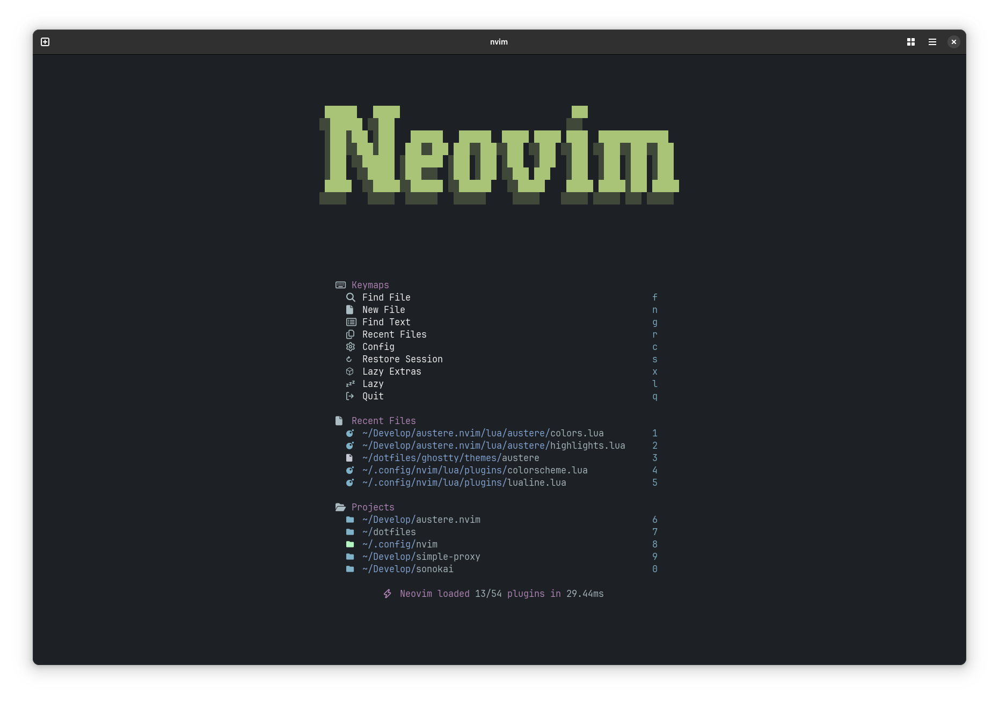
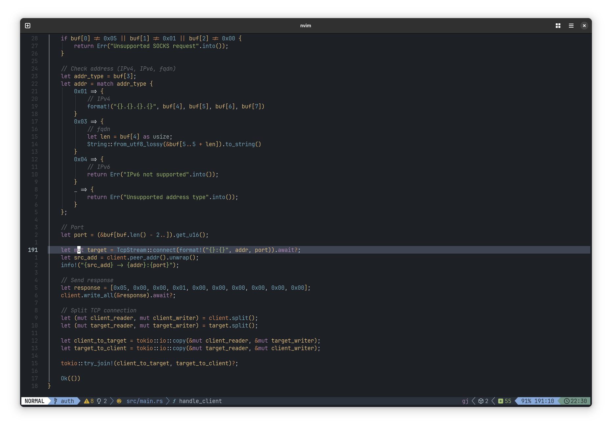
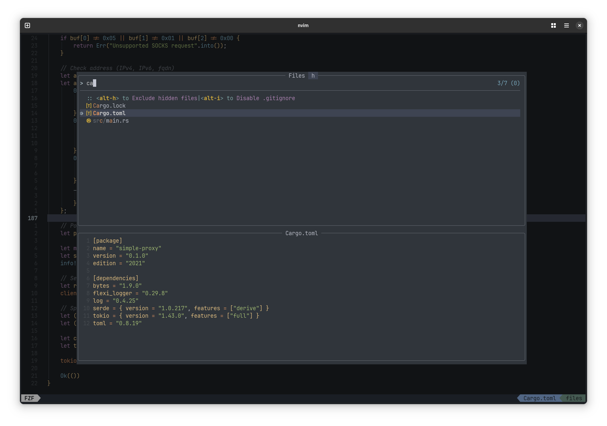

# "Austere" dark theme for neovim

## Features

- High contrast color theme with a low saturation and smooth colors
- Many plugins supported

  
  
  
  

> [!WARNING]
> The color scheme is under deep development.
> But it will be very useful to get feedback.

## Roadmap

- Transparent supported

## Requirements

- neovim >= 0.8

## Supported plugins

- NeoTree
- blink.cmp
- diffveiw.nvim
- fzf-lua
- gitsings.nvim
- noice.nvim
- render-markdown.nvim
- snacks.nvim
- telescope.nvim

## Install

Only use with lazy plugin manager:

```bash
{
    "romanaverin/austere.nvim",
    name = "austere",
    priority = 1000,
    opts = {},
  },
  {
    "LazyVim/LazyVim",
    opts = {
      colorscheme = "austere",
    },
  },
}
```

## Options

To configure options, add `opts` to the plugin declaration:

```bash
opts = {
  terminal_colors = true, -- sets terminal colors
  italic = true, -- use italic font style
  dimmed_background = false, -- use more dim background
}
```

For the lualine add this

```bash
require('lualine').setup {
    options = {
        theme = "austere"
        -- ... the rest of your lualine config
    }
}
```
