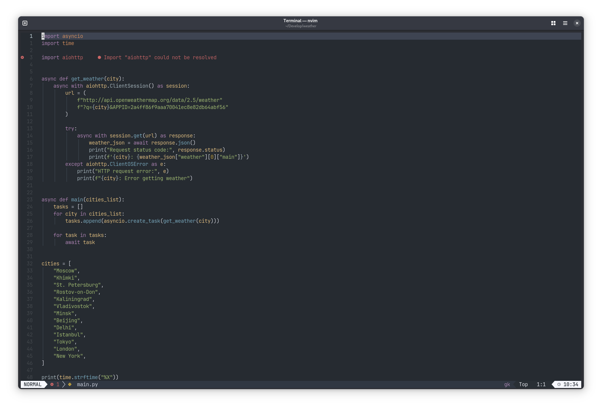

# Austere Theme for neovim



> [!WARNING]
> The plugin is under deep development.
> But it will be very useful to get feedback.

## Requirements

- neovim > 0.9

## Supported plugins

- render-markdown.nvim
- snacks.nvim
- diffveiw.nvim
- gitsings.nvim
- telescope.nvim
- fzf-lua
- NeoTree

## Install

Only use with lazy plugin manager:

```bash
{
    "romanaverin/austere.nvim",
    name = "austere",
    priority = 1000,
    opts = {},
  },
  {
    "LazyVim/LazyVim",
    opts = {
      colorscheme = "austere",
    },
  },
}
```
